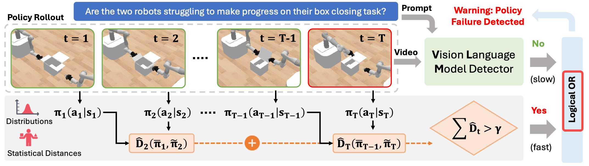
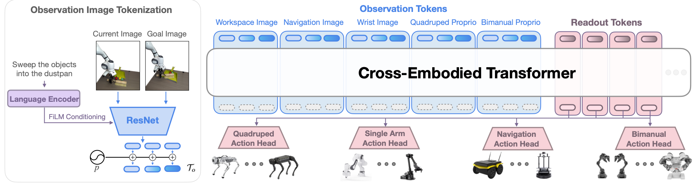
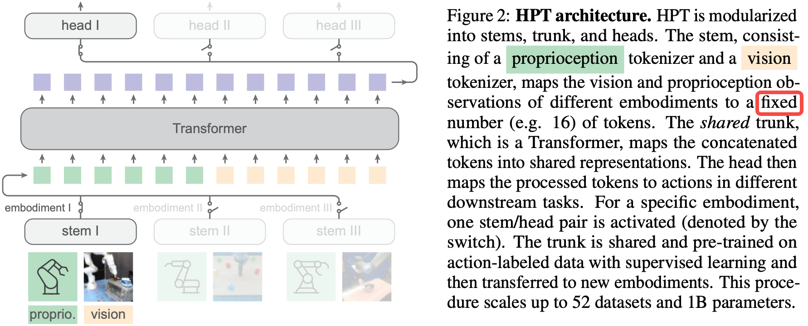
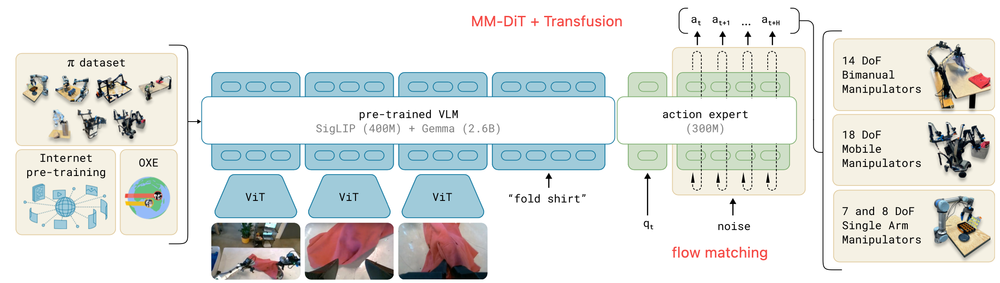
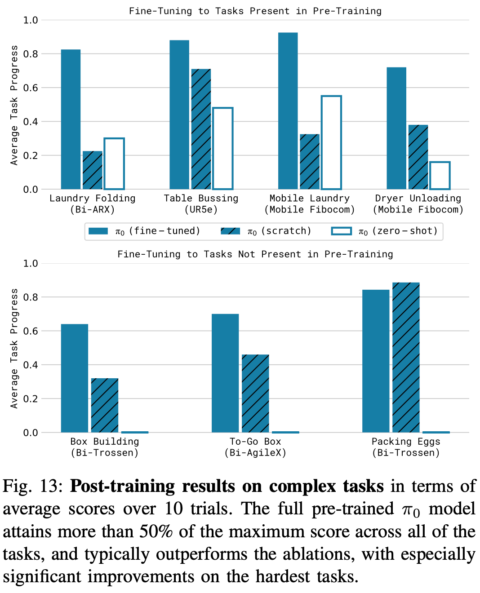

# Research Paper Distillation By Zhenghao Chi

> To see paper recommendation level and tags, visit the doc on Lark [here](https://ndro4zkb6p.feishu.cn/docx/FaBXdERDvoleXDxSiMXcMBegnvd?from=from_copylink).

# Robotics

### HumanPlus: Humanoid Shadowing and Imitation from Humans

> Fu, Z., Zhao, Q., Wu, Q., Wetzstein, G., & Finn, C. (2024). HumanPlus: Humanoid Shadowing and Imitation from Humans. _arXiv preprint arXiv:2406.10454_.

- General Idea:

  1. **X-embodiment Shadow policy**: RGB third-vision human bahaviour -> humanoid bahaviour
  2. Data collection for behaviour cloning: Use shadow policy + human demonstration, humanoid get **egocentric binocular RGB camera** data of conducting a task.
  3. Use key point representation as 'high-level' guidance (conditioning) of low level policy. The robot only knows how to achieve a paramatrized pose.
- Some technical points

  1. During shadow policy training, the DoF of robot and human are diff. Need to map between paramatrization of these two. Then they can train policy using RL.
  2. RL policy inputs humanoid proprioception and a humanoid target pose; outputs target joint position&velocity. Then they have a PD controller to get torque.
- Limitations

  1. Fixed mapping between different DoF parametrization
  2. Error can be cascaded -> error of pose estimation & RL policy & testing error
  3. No long-horizon task because no large size of human demonstration
- Utilities

  1. Human pose paramatrization model: [SMPL-X](https://smpl-x.is.tue.mpg.de)
  2. Human body pose sequence dataset: [AMASS](https://amass.is.tue.mpg.de)
  3. State-of-art body & hand pose estimation model: need survey

### GNM: A General Navigation Model to Drive Any Robot

> Shah, D., Sridhar, A., Bhorkar, A., Hirose, N., & Levine, S. (2023, May). Gnm: A general navigation model to drive any robot. In _2023 IEEE International Conference on Robotics and Automation (ICRA)_ (pp. 7226-7233). IEEE.

- General Idea:

  1. Image-goal navigation (image observation of the goal position) to allow general formulation of the task
  2. Hand-crafted abstract action representation as policy output (execution depends on controller)
  3. Learnt embodiment context vector using consecutive past observations from robot's viewpoint and condition the policy on it.
- Limitation:

  1. Hand-craft action representation
  2. The embodiment vector mostly contains info of velocity,size, etc. Not 'what it can do' or affordance. So no 'brand-new' navigation strategy emerged tailored to the capabilities of new embodiments.

### Neural MP: A Generalist Neural Motion Planner

> Dalal, M., Yang, J., Mendonca, R., Khaky, Y., Salakhutdinov, R., & Pathak, D. (2024). Neural MP: A Generalist Neural Motion Planner. _arXiv preprint arXiv:2409.05864_.

- General Idea

  1. Diverse scene generation in simulation and use 3D object datasets
  2. Distill motion planning via visual imiation learning
  3. Test time optimization to enhance safety
  4. Just marginal improvement of perf and largely the same as [MπNets](https://proceedings.mlr.press/v205/fishman23a.html).
- Utilities

  1. Large 3D obj dataset [Objaverse](https://objaverse.allenai.org)

### MimicGen: A Data Generation System for Scalable Robot Learning using Human Demonstrations

> Mandlekar, A., Nasiriany, S., Wen, B., Akinola, I., Narang, Y., Fan, L., ... & Fox, D. (2023). Mimicgen: A data generation system for scalable robot learning using human demonstrations. _arXiv preprint arXiv:2310.17596_.

- General Idea

  1. Data augmentation paper: generate more data from a few human demonstrations
  2. Simple learning algorithm and hardware: naive behavior cloning + 1 * V100
  3. Tasks must be divisible into **object-centric subtasks** (see appedix K)
  4. Linear interpolation between each subtask
  5. Use $T^A_B$ frame transformation to generate new data with **fixed gripper-object relative pose**
- Limitation

  1. Object-centric subtask assumption (and exactly one obj per subtask)
  2. Naive data filtering (success or not)
  3. No guarantee on collision-free motion (especially during interpolation)
  4. Objects should be rigid-body and new data only has similar objects as source data
  5. Objects and robot bases can't be dynamic
  6. Can't support multi-arm tasks
- Utility

  1. Some related literatures in appendix: Full related work section & motivation for mimicgen over alternative methods section

### Contrastive Representation Learning

> Weng, Lilian. (May 2021). Contrastive representation learning. Lil’Log. [https://lilianweng.github.io/posts/2021-05-31-contrastive/](https://lilianweng.github.io/posts/2021-05-31-contrastive/).

- Key points

  1. Hard negative samples are needed to improve the model
  2. What does it mean by 'hard': different label but close in embedding space (thus need to 'drag apart')
  3. Large batch size is typically needed, so the data is diverse
- Utility

  1. [Blog post on explaining BYOL and intuition of why contrastive learning](https://imbue.com/research/2020-08-24-understanding-self-supervised-contrastive-learning/): Batch normalization implicitly introduce contrastive learning in BYOL
  2. Visual data augmentation methods can be checked
  3. Works on loss function design

### Robot Learning on the Job: Human-in-the-Loop Autonomy and Learning During Deployment

> Liu, H., Nasiriany, S., Zhang, L., Bao, Z., & Zhu, Y. (2022). Robot learning on the job: Human-in-the-loop autonomy and learning during deployment. _arXiv preprint arXiv:2211.08416_.

- General Idea

  1. Enable human intervention during policy deployment to continuously improve the policy
  2. Weight behavior cloning by data quality approximated by two criteria: First, human interventions are high quality and should be learnt immedietely; Second, trajectory right before intervention is of bad quality
  3. Label data using classes: demo(initial human demo data), intervention, prev-intervention, robot
  4. Memory management strategy: LFI - first reject samples from trajectories with the least interventions
- Limitation

  1. Requires the human to constantly monitor the robot. Should incorporate automated runtime monitoring and error detection strategies.
  2. Experimental tasks only contain insertion. This is ideal for human intervention, but class labels may have different relative importance in other types of tasks
- Interesting Points

  1. LFI memory management strategy outperforms the 'keep all' strategy. This is totally a **dataset distillation** method. Also, high quality data may be under-learnt when data size explodes because batch size is limited

### RoboCook: Long-Horizon Elasto-Plastic Object Manipulation with Diverse Tools

> Shi, H., Xu, H., Clarke, S., Li, Y., & Wu, J. (2023). Robocook: Long-horizon elasto-plastic object manipulation with diverse tools. _arXiv preprint arXiv:2306.14447_.

- General Idea

  1. Perception: Model surface shape change of elasto-plastic stuff with PointCloud and Graph
  2. Action parametrization: Parametrize tool usage action to reduce DoF
  3. Model interaction with elasto-plastic stuff: Goal is to predict how the shape of elasto-plastic stuff will change give an action with a tool. Data collected by robot randomly interact with elasto-plastic stuff and minimize distant between predicted graph and real graph. The result is GNN.
  4. Self-supervised optimal action policy: Given a,b,c, train a policy to get an action to transfer elasto-plastic stuff between states. Data collected in c is reusable by giving action label and states before&after this action. The policy learns by predicting the action label
  5. Closed-Loop Control: Given a,b,c,d, choosing tool that can achieve state closest to the goal state -> Do the action -> Get next state -> next loop
- Limitation

  1. So many learning techniques to achieve Best System Paper Award, CoRL 2023
- Interesting Point

  1. Describe interaction with elasto-plastic stuff with GNN + Point Cloud
  2. **Self-supervised policy design enables cheap and fast real-world data collection pipeline**
  3. Inductive bias of GNN. Train on predicting 2 steps, inference on predicting 15 steps
  4. Achieved **ultra fast planning speed** compared with previous work
- Utility

  1. Lots of GNN+PointCloud techniques
  2. Writing style: Divide sections by problems to be solved and start each section from a problem

### The Plenoptic Function and the Elements of Early Vision

> Adelson, E. H., & Bergen, J. R. (1991). _The plenoptic function and the elements of early vision_ (Vol. 2). Cambridge, MA, USA: Vision and Modeling Group, Media Laboratory, Massachusetts Institute of Technology.

- General Idea
  1. The whole scene can be represented by a plenoptic function whose parameters are properties that can be directly measured by retina ( $x,y,t,\lambda,V_x,V_y,V_z$ in the paper - $x,y$ are point on a plane in front of the eye position, $t$ is time, $\lambda$ is wavelength or color, $V_x,V_y,V_z$ are position of the eye)
  2. Creatures **sample** viewpoint in some ways (i.e: moving head) to get an instance of input of the plenoptic function
  3. A sample (viewpoint) can be viewed as chunked Taylor expansion - direct measurement of the local properties of a plenoptic function

### CyberDemo: Augmenting Simulated Human Demonstration for Real-World Dexterous Manipulation

> Wang, J., Qin, Y., Kuang, K., Korkmaz, Y., Gurumoorthy, A., Su, H., & Wang, X. (2024). CyberDemo: Augmenting Simulated Human Demonstration for Real-World Dexterous Manipulation. In _Proceedings of the IEEE/CVF Conference on Computer Vision and Pattern Recognition_ (pp. 17952-17963).

- Main Result
  1. Human demonstration in simulation + augmentation in simulation + fine-tune with real-world demonstration can work.

### AnySkin: Plug-and-play Skin Sensing for Robotic Touch

> Bhirangi, R., Pattabiraman, V., Erciyes, E., Cao, Y., Hellebrekers, T., & Pinto, L. (2024). AnySkin: Plug-and-play Skin Sensing for Robotic Touch. _arXiv preprint arXiv:2409.08276_.

- Main Result

  1. Improve consistency between touch sensor instances
  2. Tactile-only and LSTM-based slip detection policy achieves 92% accuracy on untouched objects
  3. [Open-sourced hardware](https://any-skin.github.io)
- Potential Future Work

  1. More experiment on how much instance-consistency is needed for tactile sensor
  2. The slippery detection policy is trained on human labelled slipped-or-not data. May check more convenient data collection methods and how to integrate them into normal data collection loops (i.e supervised by visual input and improve itself on-the-fly).
  3. Tactile algorithm and representation that facilitates truly hard tasks like cloth folding

### A Tutorial on Energy-Based Learning

> LeCun, Y., Chopra, S., Hadsell, R., Ranzato, M., & Huang, F. (2006). A tutorial on energy-based learning. _Predicting structured data_, _1_(0).

- Main Concepts
  1. The energy-based model learns an energy function $E_\theta(X,Y)$ so that at inference time, given the input $X$ , $argmin_{y\in \mathbb{Y}} E_\theta(X,y)$ is the output. So optimization is needed for inference.
  2. For training, the goal is 'pull up' $E_\theta(X,Y)$ of $y_{wrong}$ and 'pull down' $E_\theta(X,Y)$ of $y_{right}$ . There can be multiple $y_{right}$ .
  3. An idea of loss function is to punish those offending outputs. Offending outputs are $y$ 's that have very low energy so that can be easily detected as good ones. $Loss = E_\theta(X^i,Y^i)+\frac{1}{\beta}log(\int_{y\in\mathbb{Y}}exp\left[-\beta E_\theta(X^i,y)\right])$ is acceptable because $\frac{\partial Loss}{\partial \theta} = \frac{\partial E_\theta(X^i,Y^i)}{\partial \theta} - \int_{y\in\mathbb{Y}} \frac{\partial E_\theta(X^i,y)}{\partial \theta}*P_{\theta}(y|X^i)$ where $P_\theta(y|X^i) = \frac{e^{-\beta E_\theta(X^i,y)}}{\int_{y\in\mathbb{Y}}e^{-\beta E_\theta(X^i,y)}}$ .  So the implication of this loss is to pull down the right answer and meanwhile pull up wrong answers proportion to their 'offending level'.
  4. $\int_{y\in\mathbb{Y}}e^{-\beta E_\theta(X^i,y)}$ is intractable. This causes instability of training when estimated with negative sampling (i.e: the implicit BC paper). **But the idea of this contrastive loss is inspiring**!!! This is solved by only estimating gradient of energy function $w.r.t $ output variable $\frac{\partial E(X^i,y)}{\partial y} = F_\theta(y|X^i)$ , which is the idea of diffusion models.

### OpenVLA: An Open-Source Vision-Language-Action Model

> Kim, M. J., Pertsch, K., Karamcheti, S., Xiao, T., Balakrishna, A., Nair, S., ... & Finn, C. (2024). OpenVLA: An Open-Source Vision-Language-Action Model. _arXiv preprint arXiv:2406.09246_.

- Main Idea

  1. Fine-tune a visual-language model with visual encoder + projector + LLM backbone with only one image input using the Open-X dataset.
- More questions

  1. SigLIP-DinoV2 visual encoder 'gives spatial understanding'. Check this paper: "Prismatic vlms: Investigating the design space of visually-conditioned language models".
  2. Fine-tuning visual encoder together, rather than freezing it is essential for the perf. The question is what is the difference between the initial visual representation and the fine-tuned representation. Check out.

### HOVER: Versatile Neural Whole-Body Controller for Humanoid Robots

- Main Idea

  1. Unify the command space of humanoid robots with various downstream tasks
- Methods

  1. Train goal-oriented behavior tracking oracle policy and distill. Add mask if the downstream policy is only considered on a subspace of the unified command space.
- My thoughts

  1. Experiments show it can outperform specified command space or method.
  2. **The interesting question is how information from one subspace can help the representation of action in another subspace and thus form a more coordinated whole body control. Can we do self-supervised motion prediction and generation in the unified command space**??
  3. It is still embodiment-specific. The key is it unifies command space of a single embodiment configuration regardless of the downstream tasks.
  4. Many works intentionally avoid high-dim command space by introducing 'end-effector tracking'. Also, high-dim command space is hard for imitation learning. **How to incorporate the unified command space with imitation learning pipeline**?

### Steering Your Generalists: Improving Robotic Foundation Models via Value Guidance

- Main Idea

  1. Test-time search for robots: Re-rank different actions proposed by a pre-trained policy through offline RL
  2. Pre-trained policy: robot doing task following language command $\pi(a|s_t,l)$ . Dataset: $\{\tau_i,l_i\}_{i=1}^N$ where the former is robot action trajectory and the latter is the language command.
  3. Re-rank: sample $K$ actions and $a_t \sim \text{Softmax} \left( \frac{Q_{\theta}(s_t, a_1)}{\beta}, \dots, \frac{Q_{\theta}(s_t, a_K)}{\beta} \right)$ . When $\beta \rightarrow 0$ , the algo is more and more greedier.
- Main results

  1. Very big experiment improvement on some tasks!!
  2. $K=100$ needs inference time 0.15 second. “Compute-optimal” balance between using the policy and querying the value function is needed. Intuition is the value function query can be done in a more high-level way. **The key question is "on what level should we search" for robots**?
  3. "Scaling up value function architectures and using more diverse data is a promising direction for future work".
- Utility

  1. Reward crafting method from arbitrary dataset: "Pre-training for robots: Offline rl enables learning new tasks from a handful of trials".
  2. New value funciton estimation algo: Cal-QL
- TODO

  1. **Do experiment on Cal-QL and re-implement this paper.**

### DexMimicGen: Automated Data Generation for Bimanual Dexterous Manipulation via Imitation Learning

- Main evolution from MimicGen

  1. Solve the data augmentation of bimanual manipulation by defining three task sync schemas.
  2. First schema: sequential task. Certain arm objectives must be com- pleted before other objectives can be attempted.  For instance, the left should first put the vegetable into the bowl, then the right arm can put the bowl onto the plate. This sync schema is solved by defining pre-task and post-task constraints.
  3. Second schema: coordination task. Two arms achieve the shared goal. The actions within subtask must be perfectly sync'ed. For instance, two arms lift a stuff together; or two arms handover a stuff. This is solved by perfectly aligning the subtask conduction of two arms. For handover subtasks, no augmentation is conducted and the handover is done by totally replaying the source demo.
  4. Third schema: each arm can operate independently of the other arm to achieve different goals. For instance, two arms want to reach different objects. This is solved by giving a separate queue of subtasks for each arm. (I am worried if two arms will collide if treated independently...)
- Main experiments

  1. Real-world experiment. Only one task is experimented. Human teleoperates robot in the real world and map the demo to sim using digital twin. Data augmentation is done in sim. By augmenting 4 source demos into 40 demos, the success rate goes from 0% to 90% in the real-world.
  2. Simulation experiment. Bimanual arms, humanoid with grippers and humanoid with dexterous hands are used. To do teleoperation, human-robot calibration is needed by enforcing human to start at a specific pose. 5~10 source demos can become 1k demos. Task success rate can go from 10% to 85%. (Maybe because the number of source demos is too small, so the benchmark performance is too bad...)
- My thoughts

  1. How can we leverage failed demo during data augmentation? Should inspect why the generated demo may fail. This may be useful to learn representation of critical states through contrastive learning.

### Data Scaling Laws in Imitation Learning for Robotic Manipulation

> Lin, F., Hu, Y., Sheng, P., Wen, C., You, J., & Gao, Y. (2024). Data Scaling Laws in Imitation Learning for Robotic Manipulation. _arXiv preprint arXiv:2410.18647_.

- Takeaways
  - The biggest bottleneck of the UMI data collection system is that it uses SLAM to track the camera pose. Therefore, lack of visual features or large objects obstructing the camera's view can lead to invalid UMI data.
  - Object and environment variety matters. Data quantity only needs to achieve a certain threshold.
  - Dividing big tasks into small subtasks can be useful for reward crafting.

### Rekep: Spatio-temporal reasoning of relational keypoint constraints for robotic manipulation

> Huang, W., Wang, C., Li, Y., Zhang, R., & Fei-Fei, L. (2024). Rekep: Spatio-temporal reasoning of relational keypoint constraints for robotic manipulation. _arXiv preprint arXiv:2409.01652_.

- Main idea: ReKep tries to solve manipulation task by: 1. getting several 'keypoints' related to the task in the environment; 2. formulating the requirements for the success of the task as constraints of the relation between keypoints; 3. solving end-effector pose of robot
- Keypoint extraction. Use DINOv2 + SAM to extract keypoints of a task. For instance, for the task of grasping a teapot and pouring water into a cup, the keypoint is teapot handler + teapot spout + cup position.
- Manipulation task success requirements as constraints between keypoints. Still take tea pouring as an example. This task can be split into three subtasks: grasp the teapot; align the teapot spout right above the cup + pour. The keypoint constraints of the three subtasks are: the robot eef position should be close enough to the teapot handler (constraint between eef and keypoint 1); the teapot spout should be right above the cup position (constraint between keypoint 2 and 3); the line between the teapot handler and the spout should be rotated to enough angle so that the water can be poured out (constraint between keypoint 1 and 3, need to be satisfied to make the subtask considered done, so called '**subgoal constraint**'), and the eef should always hold the teapot handler during pouring (constraint between eef and keypoint 1, need to be satisfied during the subtask so called '**path constraint**').
- Constraint formulation. Use keypoint visualized in the image + prompt feeding VLM to get constraints implemented in python. The interface is `def constraint(end_effector, keypoints)`.
- Motion planning. First solve the subgoal eef, that is, find the eef pose so that the 'subgoal constraint' can be satisfied. Then solve the eef trajectory to achieve the subgoal eef so that the 'path constraints' and other collision-avoidance constraints can be satisfied.
- My takeaway and utility

  - Relationship between points can used to specify complicated 3-D things. For instance, mean value of some points can be used to specify a position of something; several keypoints together can be used to specify a surface. **MimicGen currently can't generate deformable object manipulation demo. Is it possible to do so by using several points as the 'relative object'**?
  - A lot of collision-avoidance and point tracking methods/packages are introduced in the A.8 appendix and [github repo](https://github.com/huangwl18/ReKep?tab=readme-ov-file#real-world-deployment).
  - **The biggest limitation, IMO, is that the low-level control policy given the keypoints are not very good. The keypoints extraction + constraint generation pipeline is very good**. The next thing is how to get a good low level control policy. MimicGen and imitation learning can be considered joining the pipeline!!!!

### EgoMimic: Scaling Imitation Learning via Egocentric Video

> Kareer, S., Patel, D., Punamiya, R., Mathur, P., Cheng, S., Wang, C., ... & Xu, D. (2024). EgoMimic: Scaling Imitation Learning via Egocentric Video. _arXiv preprint arXiv:2410.24221_.

- Try to use human egocentric data + teleoperation data to train robots. Huge amounts of methods to prevent distribution shifts. For example, use the same ego sensor (Aria) + mask the image with SAM2 + normalize actions.
- Input masked human & robot ego images + human hand pose traj estimation + robot eef pose traj & joint position data (get through teleoperation). A transformer will encode all data. Loss is human pose prediction error, robot eef pose prediction error and robot joint position prediction error. The control is done in the joint space.
- Co-training with human hand data benefits a lot. Distribution alignment matters a lot. **Other works (i.e: MimicPlay) use human data to train a planner to condition the low-level control policy suffers at generality**.
- Utility: check the [Aria](https://facebookresearch.github.io/projectaria_tools/docs/intro) project, academic-use ego-centric hardware.

### [Unpacking Failure Modes of Generative Policies: Runtime Monitoring of Consistency and Progress](https://arxiv.org/pdf/2410.04640)

Let $\pi_t = \pi(a_{t+k:t+h-1 \mid t} \mid s_{t})$ and $\pi_{t+k} = \pi(a_{t+k:t+h-1 \mid t+k} \mid s_{t+k})$, if $D_{KL}(\pi_t,\pi_{t+k}) > \gamma$ where $\gamma$ is calibrated using successful trajectory, then the robot is deemed as 'prone to fail' and will raise a warning. Overlap exists because of setting in action chunk. The intuition is that successful robo trajectories are smoother and will have lower $D_{KL}(\pi_t,\pi_{t+k})$. Conformal prediction theory in statistics can provide some bounds. Combining it with VLM error detection (higher latency, but good at detecting some smoother error like confidently putting stuff in the wrong place), the total system works well. Combination is an 'OR' logic.

[Another researcher](https://rsluo.github.io) provides more rigorous and thorough analysis of robot OOD detection using conformal theory.

### [Scaling Cross-Embodied Learning: One Policy for Manipulation, Navigation, Locomotion and Aviation ](https://arxiv.org/pdf/2408.11812)

130M paras. One observation encoder is set for each type of camera pose. One readout token is set for each action in the action chunk. After each timestep obs, a sequence of readout tokens is added. One action head (action decoder) is set for each downstream embodiment. So the obs encoder and action decoder are like MoE. Each readout token is "summarization of the observation of the timestep to conduct action of a specific future timestep". Dataset see appendix A.

**Expriment**. All evaluation tasks are in-distribution, so no fine-tune is needed. Comparison is done between best prior X-embodiment model and train the same model with task-specific data only. For manipulation tasks, the success rates are just bad.

### [Scaling Proprioceptive-Visual Learning with Heterogeneous Pre-trained Transformers](https://arxiv.org/pdf/2409.20537)

1B paras. The "read out tokens" are added before fed to the main transformer backbone. Pro and vision obs are first encoded by some encoder and then embedded as fixed length of sequence through attention. This is much more memory efficient compared to the work above because it avoid a lot of masking. Dataset see A.1 appendix.

**Experiment**. No analysis of whether the test settings are in-distribution or OOD. Tests are done in sim and real. First test suite compare different fine-tune strategies like froze the trunk or not. Second test suite compare the fully fine-tuned HPT with other model.

### [π0: A Vision-Language-Action Flow Model for General Robot Control](https://arxiv.org/pdf/2410.24164)

3B paras. Closed-source training & post training data. Training data is very diversed and include mistake recovery. Flow matching for action head, transfusion & MM-DiT architecture mix, pretrained VLM for obs encoding. Unified action space (18-dim) and zero pad action of embodiment with lower dim action.

**Experiment**:

- **How well does π0 perform after ****pre-training ****on a variety of tasks that are present in the pre-training data?** > 90% even for deformable object manipulation. Significantly outperform previous methods like OpenVLA or Octo. Also has ~10% absolute success rate gain compared to model trained with task-specific data.
- **How well does π0 follow language commands? **VLM is essential to this. Model with VLM can follow language command much better and thus can benefit from human experts' intermediate command (e.g. put what to where).
- **How does π0 adapt to new unseen dexterous manipulation tasks that require new behaviour?** ~ 5 hours of fine-tuning data is needed for each task. On all tasks $\pi_0$ outperforms or is comparable with model trained only with task-specific data. It outperforms any other model like OpenVLA.
- **Can π0 be adapted to complex, multi-stage tasks?** "For some of these tasks, data is present in pre-training, but fine-tuning is required to attain mastery. For some, no data is present in pre-training." "Note that many of these more difficult tasks show a very large improvement from using the pre-trained model, indicating that pre-training is especially useful with harder tasks."
  

# Fundamental Research of AI

### Scaling Rectified Flow Transformers for High-Resolution Image Synthesis

> Esser, P., Kulal, S., Blattmann, A., Entezari, R., Müller, J., Saini, H., ... & Rombach, R. (2024, March). Scaling rectified flow transformers for high-resolution image synthesis. In _Forty-first International Conference on Machine Learning_.

- This is the paper of stable diffusion 3. **It is a very good writing sample of a research paper on image generation**. It proves the scalability of rectified flow in image generation tasks and it can outperform DiT and Unet. Also, it has a very well-written introduction on flow matching and diffusion. The code the the double stream block is [here](https://github.com/black-forest-labs/flux/blob/main/src/flux/modules/layers.py#L129-L191) and the sampling code is [here](https://github.com/black-forest-labs/flux/blob/main/src/flux/sampling.py#L241-L271).
- Main points/tricks

  - Effective SNR ratio (noise scheduling) for rectified flow. The intuition is to give the timestep in the middle more weights. "Intuitively, however, the resulting velocity prediction target $\epsilon-x_0$ is more difficult for $t$ in the middle of $[0,1]$ , since for $t=0$, the optimal prediction is the mean of $p_1$, and for $t=1$ the optimal prediction is the mean of $p_0$. "
  - MM-DiT backbone that outperforms Cross-DiT and UNet. The key point is to give separate weights to the text and image embedding while only concatenating them during attention operation. This makes them to be processed separately but can also integrate each other's information during attention.
  - RMS-Norm for Q and K before attention to prevent attention-logit explosion.
  - For latent image autoencoder, user channel size $d=16$ because bigger latent channel size leads to significantly higher generation quality.
  - Use synthetized image captions generated by VLM rather than original image captions generated by humans. It is because human's caption can be overly simplistic. A mixture of 50% from both sources is good.
  - Shift noise schedules for different resolutions. The model is trained on $256^2$ image but finetuned on higher resolution image. "Intuitively, since higher resolutions have more pixels, we need more noise to destroy their signal". So they use human-perference rating to tune the parameter to scale the noise for higher resolution finetuning.
  - The text embedding is conceptually split into context (sequence) representation that give holistic fine-grained information and single-vector representation that gives less information. The former is used as model input. The latter is used as modulation mechanism (AdaptZero, proposed in DiT) together with timestep.

### Were RNNs All We Needed?

> Feng, L., Tung, F., Ahmed, M. O., Bengio, Y., & Hajimirsadegh, H. (2024). Were RNNs All We Needed?. _arXiv preprint arXiv:2410.01201_.

- Main hypothesis

  - The success of Mamba and S4 is because that the proposed hidden state $\hat{h_t}$ does not depend on the past state. That is, the key bone of those RNN models is: $z_t=Z(x_t)$ , $h_{t+1}=(1-z_t)*h_t+z_t*h(x_{t})=(1-z_t)*h_t+z_t*\hat{h_t}$ . Can we achieve similar efficiency and performance using this minimal key bone?
- Main result

  - Very weak experiment because the tasks are extremely easy and tailored to the author's model.
  - Reasonable hypothesis. And the model may be useful in specific tasks that are OK with the model's downsides.
  - Keybone needs more layers because although the first layer capture little global info, upper layers can do that. (trade-off)

### Cal-QL: Calibrated Offline RL Pre-Training for Efficient Online Fine-Tuning

> Nakamoto, M., Zhai, S., Singh, A., Sobol Mark, M., Ma, Y., Finn, C., ... & Levine, S. (2024). Cal-ql: Calibrated offline rl pre-training for efficient online fine-tuning. _Advances in Neural Information Processing Systems_, _36_.

- Main Points
  1. Scenario is policy initialization using offline RL trained on large dataset and fine-tune on downstream tasks
  2. Previous CQL has an 'unlearning' phenomenon. Since CQL tends to learn a Q-function $\hat{Q}$ much smaller than true value, at the beginning of the fini-tuning, any exploration can get a better return than $\hat{Q}$ of even the learned best action. Thus, the updated $\hat{Q}$ will have highest value at exploration action and thus 'unlearn' the learned policy.
  3. The solution is given by calibration. Intuition is to keep $\hat{Q}$ on the right scale during pre-training. For two policies $\pi$ and $\mu$ , $\pi$ is calibrated with respect to the reference policy $\mu$ if $\mathbb{E}_{a \sim \pi} \left[ Q_{\theta}^{\pi}(s, a) \right] \geq \mathbb{E}_{a \sim \mu} \left[ Q^{\mu}(s, a) \right] := V^{\mu}(s), \, \forall s \in D$ .
  4. Theory and experiments show that a not so good reference policy can have a good calibration effect (because calibration only takes care of the scale of $\hat{Q}$ ). The behavior policy of the large dataset is a good reference, because $Q^{\mu}(s, a)$ can come from crafting reward signal from the success or not signal of the pre-training dataset.
  5. Simple change of algo!! Good theory with good experiment results!

### Flow Matching for Generative Model

> Lipman, Y., Chen, R. T., Ben-Hamu, H., Nickel, M., & Le, M. (2022). Flow matching for generative modeling. _arXiv preprint arXiv:2210.02747_.

- Main Question

  - How to gradually transfer a known distribution into another distribution when we only have samples from the latter?
- Main Idea

  - Define a flow $\phi_t{(x)}$ , where $\phi_o(x)=x$ . Define a time variant vector field $\frac{d}{dt}\phi_t(x)$ . Then, starting from point $x$ sampled from a known distribution, if we follow the vector field (the dynamic of the flow), we can **gradually **move into a new distribution.
